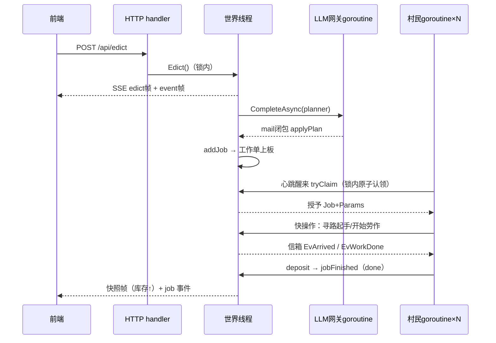
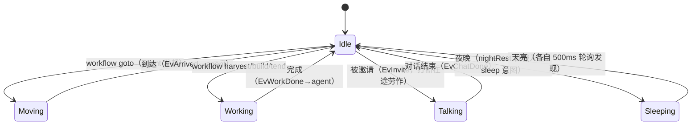
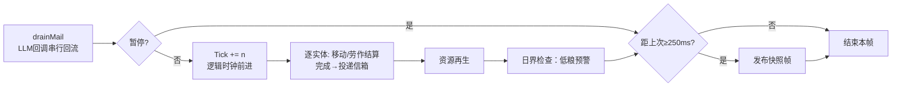

# 架构文档

## 1. 总览

```
┌─ 浏览器（Vite + TS + PixiJS 8）────────────────────────────┐
│  渲染：瓦片/资源/建筑/居民精灵 + DOM 气泡/铭牌（相机同步）  │
│  UI：顶栏 / 居民面板 / 领主控制台 / 设置 / 新建世界         │
└───────────────┬────────────────────────────────────────────┘
        REST（POST 指令/配置/建世界）          SSE（GET /api/events）
┌───────────────┴────────────────────────────────────────────┐
│  server：路由 / SSE Hub 扇出 / 静态 SPA（go:embed）         │
├────────────────────────────────────────────────────────────┤
│  game：编排层 = 世界线程（唯一物理权威）+ 每村民一个 goroutine │
│   ├─ 世界线程：邮箱回流 → 物理结算 → 事件投递 → 快照广播      │
│   ├─ agent：信箱 + 心跳自主决策，workflow 阻塞式执行          │
│   ├─ planner：领主指令 → LLM → 工作单（规则回退）             │
│   ├─ Conversation：两两对话（LLM 轮转，全局串行）             │
│   └─ agentHost：workflow.Host 的村民侧实现（快操作+信箱等待）  │
├────────────────────────────────────────────────────────────┤
│  workflow：JSON 模板 + 解释器（无内部依赖，纯可测试）       │
│  sim：确定性世界（瓦片/A*/移动/劳作/库存/时间，无 AI）      │
│  worldgen：LLM 世界规格 → 种子化确定性建图                  │
│  llm：BYOK 网关（openai/anthropic/mock + 限流 + 统计）      │
│  config：providers/roles/limits，落盘 data/config.json      │
└────────────────────────────────────────────────────────────┘
```

## 2. 并发模型（本项目最核心的决策）

**Actor 变体：世界单写者线程 + 每村民一个 goroutine。**

```
┌─ 世界线程（loop goroutine，唯一的物理权威）────────────────┐
│ 10Hz tick：邮箱回流 → 物理结算（移动/劳作/时间/再生）       │
│          → 完成事件投递到村民信箱 → 250ms 快照广播          │
└──────▲──────────────────────────────┬─────────────────────┘
       │ 短临界区快操作（e.mu）        │ 信箱（channel，带缓冲）
┌──────┴────────────┐    ┌────────────┴─────────┐
│ 老周 goroutine     │    │ 杏娘 goroutine ...    │
│ for {             │    │                      │
│   select 信箱/心跳 │    │ 同样结构，互相独立     │
│   思考（可阻塞调LLM）│   │                      │
│   执行 workflow    │    │                      │
│ }                 │    │                      │
└───────────────────┘    └──────────────────────┘
```

三条铁律：

1. **世界状态单写者**：`sim.World`/工作单/对话状态只被世界线程变更；村民对世界的
   一切动作（寻路起手/库存结算/认领工作单）是拿 `e.mu` 的毫秒级快操作。
2. **慢等待只阻塞自己**：走到/采完/聊完/LLM 返回都在本 goroutine 内等待——
   workflow 步骤因此可以写成自然的阻塞调用（`host.PathToEntity(...)`），一个村民
   思考 3 秒不影响任何其他人。完成判定以**世界事实轮询**为准（`waitWorld`，200ms
   一次，信箱事件只作快速唤醒），事件迟到/丢失不会卡死工作流。
3. **LLM 回调回流世界线程**：规划/对话轮转的异步结果经 `mail` 通道在世界线程串行落地。

**状态分区与访问规则**（三块状态，三套规则）：

| 状态 | 存放 | 谁写谁读 | 同步手段 |
|---|---|---|---|
| 物理态：位置/路径/Busy/Work/Hidden/库存 | `sim.World` | 世界线程 tick 推进；村民经 host 快操作改写 | `e.mu`（tickOnce 全程持锁，快操作短临界区） |
| 大脑态：记忆/关系/工作履历/心情/阶层 | `game.Citizen` | 该村民 goroutine 独占；世界线程仅受控例外（对话收尾写双方记忆与关系、入城写首条记忆） | 所有权约定（对话期间双方不思考的时序保证） |
| 提示位：sleeping/talkingWith/run/nextThink… | `game.agent` | 本 goroutine 写；世界线程与同僚仅**读**（挑聊天对象/跳夜判定/列同僚） | 无锁：只读瞬时值，旧值最多让调度慢半拍，不承担硬正确性 |
| 对外视图：状态/动作 | `atomic.Pointer[BrainView]` | 村民发布，世界线程快照读 | 原子指针，"拷贝→改副本→换指针" |

**信箱与两个读取点**（分发语义已统一为单一入口 `onMail`）：

- **停泊位**：`mainLoop` 的 select（等心跳/等信；冷却/对话/暂停期间都停在这里）
- **等待位**：workflow 的 `waitWorld`/`waitConvDone`（等"走到了/干完了/聊完了"）
- **排队区**：LLM 调用与睡觉期间谁都不读信，事件堆在容量 128 的缓冲里，回到上两个位置补处理

事件分两类：机械信号（EvArrived/EvWorkDone，只作快速唤醒，过期即丢弃）；社交/情报
事件（EvInvite=打断工作并转入对话 / EvMemo 便签记账 / EvEdict 领主指令直达）。
**两个读取点不存在语义分叉**——这是历史上最易出 bug 的地方。

**夜间快进**：全员 `sleeping` 时（`allAsleepLocked`）世界线程把时钟直接拨到次日 7:00
（`skipToMorning`）；睡着的村民由各自的 500ms 轮询发现天亮自行起床——不依赖任何通知事件。

数据所有权：村民记忆/关系 = 该村民 goroutine 私有（对外经 `BrainView` 原子发布）；
世界事实/工作单 = 世界线程；对话记忆/关系在对话收尾由世界线程统一写回双方（期间双方不思考）。

确定性边界：物理结算逐 tick 可复现；村民决策的先后由调度器决定（不可复现），
因此集成测试采用"最终断言"风格（等待期望状态出现），机制测试仍逐 tick 精确。

## 2.1 关键时序与状态图

**领主指令的全生命周期**：



**居民物理状态机（sim.BusyKind，由世界线程推进）**：



**一帧（tickOnce）流水**：



## 3. Agent 与 Workflow 的边界

| | Agent（`game.Citizen`） | Workflow（`workflow.Template/Run`） |
|---|---|---|
| 职责 | 决定"何时做哪件事" | 定义"这件事怎么做" |
| 形态 | 记忆 + 关系 + 工作履历 + 提示位 | JSON 步骤图 + 解释器 |
| AI 用法 | 规划器分解指令；村民大脑决策 | 步骤级 `ai_choice`（选分支）/ `say`（生成台词） |
| 失败 | 认领失败换人/换事 | 步骤失败带原因冒泡（"材料不足"），事件可见 |

数据流：`领主指令 → planner → Job{Type=模板ID, Params} → 平民 tryClaim 自动认领 / 官员 LLM 选择 claim_job → workflow 执行 → 完成/失败回写 Job`。

## 4. workflow 解释器

- `Run` 持有 `Queue []StepSpec`；`Execute` 顺序执行——每个步骤阻塞到完成再进入下一步
- 等待由 host 层负责：走到/干完/聊完用 `waitWorld` 双通道（世界事实轮询 +
  信箱事件快速唤醒），完成判定不依赖事件送达；LLM 步骤直接阻塞调用
- `condition` / `ai_choice` 通过**前插子分支**实现控制流（无需图数据结构）
- 所有副作用经 `Host` 接口回调（`agentHost` 实现），workflow 包零内部依赖、可独立测试
- 兜底：`waitWorld` 30s 无进展判死自愈（栈落日志）；LLM 失败向上冒泡 → 村民思考指数退避

## 5. 世界初始化 workflow

```
用户需求文本
  → LLM(worldgen 角色, JSONMode)：{name, lore, villagers[4-8]{name,role,personality}}
  → Normalize（非法职业回退、人数补足）
  → BuildWorld(spec, seed)：确定性算法
     湖+沙岸 → 十字主路 → 领主堡/民居/粮仓/农田（螺旋找位、门口必达）
     → 森林 blob / 浆果环 / 岩石角 → 村民落位（出生点必可通行）
  → SSE world 帧 → 前端重建静态层
```

同 (spec, seed) 输出逐字节一致（有测试保证）；LLM 失败回退内置"迷雾河谷"。

> 包内导览：`internal/game/doc.go` —— 文件地图 / 阅读路线 / 判断索引（建议作为读码入口）。

## 6. LLM 网关

- 客户端：`openai`（覆盖 DeepSeek/Moonshot/Qwen/智谱/Ollama/OpenRouter…，自动处理不支持 `response_format` 的网关）、`anthropic`（Messages API）、`mock`（确定性响应，离线全流程）
- 角色：`worldgen / planner / brain / dialogue / choice / narrate` 各自路由到命名提供商
- 限流：真实提供商走并发信号量 + RPM 滑动窗口（背压即省钱）；mock 不限流
- 节奏参数：`config.Pacing`（思考/社交冷却、对话轮数、事件频率、作息）→ 引擎 `Pacing()` 原子读取，设置页热更；夜间区间与开局时刻在建世界时注入 `sim.World`
- 请求超时与各角色 temperature 也在设置页可调（`limits.llm_timeout_sec` / `limits.temperatures`）
- 韧性：`ExtractJSON` 容忍代码块/前后缀文本/字符串内括号；解析失败上层走规则回退
- 统计：调用数/错误数/tokens 进出/最近延迟，随快照流推给前端仪表

## 7. SSE 协议

`GET /api/events`，每帧 `data: {json}\n\n`，心跳 15s，慢消费者丢帧（靠快照自愈）：

| t | 载荷 | 频率 |
|---|---|---|
| `snapshot` | 时间/库存/居民位置状态动作/资源量/建筑进度/工作单/统计 | 250ms |
| `world` | 全量世界（瓦片/资源/建筑/居民静态） | 创建世界、圈工地、建筑落成 |
| `event` | 日志（cat: system/world/edict/plan/job/build/chat） | 事件驱动 |
| `chat` | 一句对话（from/to/text） | 对话轮转 |
| `bubble` | 居民头顶气泡 | workflow say 节点 |
| `edict` | 领主指令广播 | 下令时 |

REST：`GET /api/state`、`POST /api/world|edict|pause|save|continue|official|exile|config|config/test`、`GET /api/config|diag|health`。

## 8. 前端要点

- **权威在后端**：前端只做 250ms 快照的插值平滑（位置 lerp、行走帧 6fps），不做任何权威判定
- **程序化纹理**：`textures.ts` 用 canvas 画出瓦片/树/浆果/岩石/建筑/居民（4 方向×2 帧行走），按 key 缓存 Texture，`scaleMode: nearest` 保证像素锐利
- **相机**：拖拽平移 + 滚轮缩放（0.6–4x，指向锚定），WebGL 精灵批渲染对集显负载极低
- **屏幕坐标 UI**：气泡/铭牌在 Pixi 的 uiC 屏幕层渲染（与精灵同帧、无 DOM 同步问题）；面板/控制台由 React + Tailwind v4 承担

## 8.1 持久化与桌面分发（2026-09）

- **存档**：SQLite（`modernc.org/sqlite`，纯 Go 无 cgo，WAL）单槽存 gzip JSON 快照：
  `sim.World`（地形/实体/库存/时间/随机源种子/发号器/认领表）+ 全体 `Citizen` + 工作单 + 指令。
  运行态（工作流/信箱/对话/移动路径）不入档——读档时重建全部村民 goroutine，从空闲状态继续生活。
- **写入时机**：游戏日界（异步单写者，不阻塞世界线程）、退出（`Stop` 内同步写）、手动（`POST /api/save`）；
  读档由前端"继续 / 新世界"选择页触发（`boot()` 只挂载后端与存档概况；继续走 `POST /api/continue` → `Engine.LoadSave`，
  开新世界会在建图后立即落一份档覆盖旧档）。`claimed` 单在存档副本里归一化回 pending。
- **桌面版**：Wails v2 只当窗口壳（`main_wails.go`，`-tags wails`）。
  **关键实测**：Wails 的 AssetServer ResponseWriter 不支持 `http.Flusher`，SSE 流式推送走不通；
  因此窗口先加载 bootstrap 页 `location.replace` 到 `127.0.0.1` 动态端口的真实 HTTP 服务，
  前端零改动、SSE 完整可用。数据目录默认 `%AppData%\aitown`（`-data` 可覆盖）。
- **字段级约定**（schema、载荷结构、归一化规则、排障方法）见 `docs/SAVE-SPEC.md`。

## 9. 目录依赖规则

```
boot/main → { game, server, store, llm, config, xlog }
server → game → { workflow, sim, worldgen, llm, config }
worldgen → { llm, sim }
store    → ∅（仅 modernc.org/sqlite）
workflow → ∅（仅标准库）
sim      → ∅（仅标准库）
```

workflow/sim 刻意保持零内部依赖：前者可独立测试解释器，后者可独立验证确定性；
store 不反向依赖 game（`game.Saver` 是接口，由 main 注入 `*store.DB`）。
